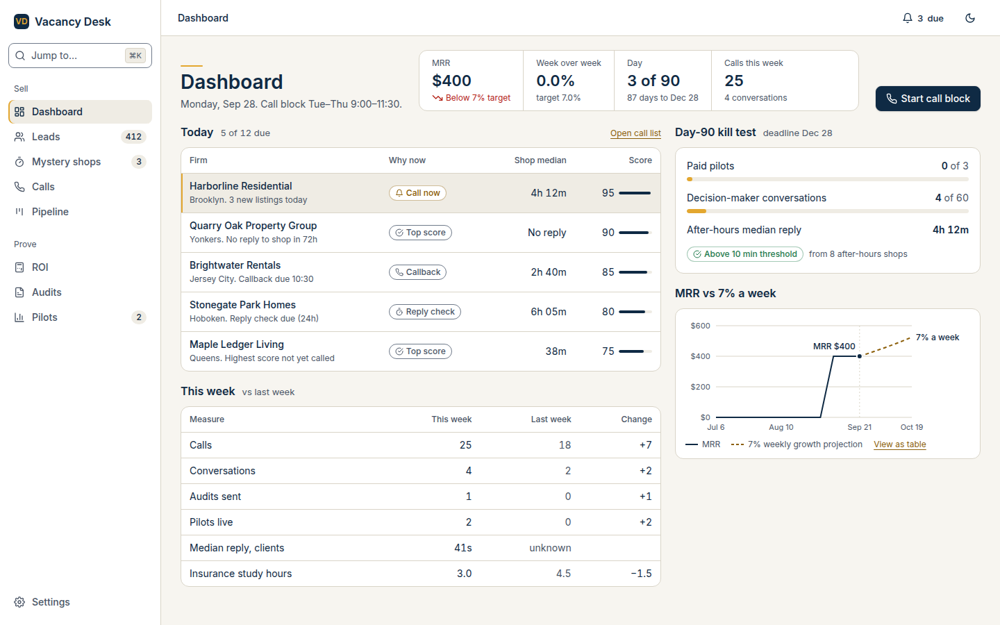
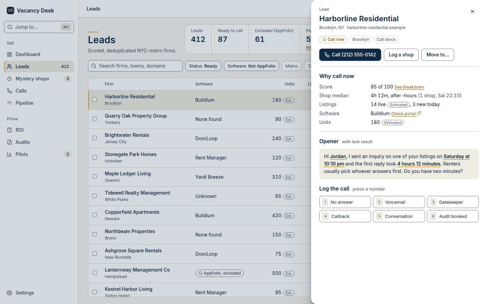
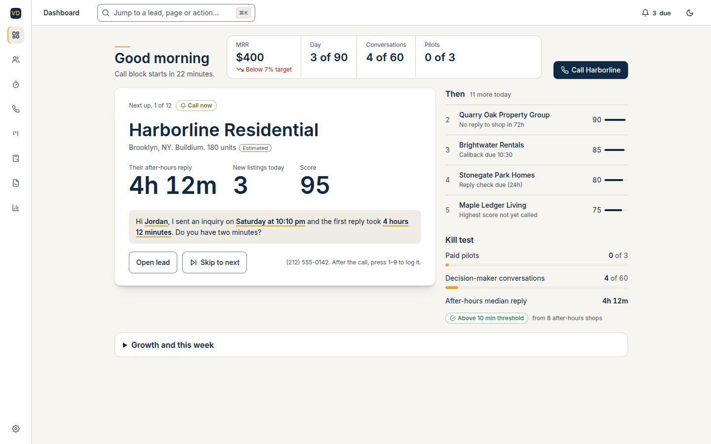
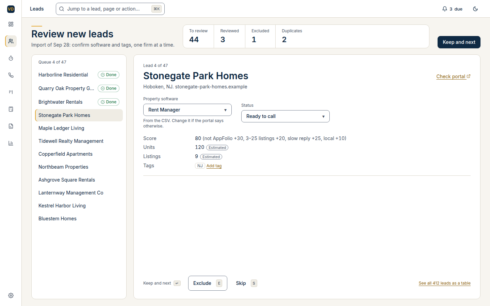
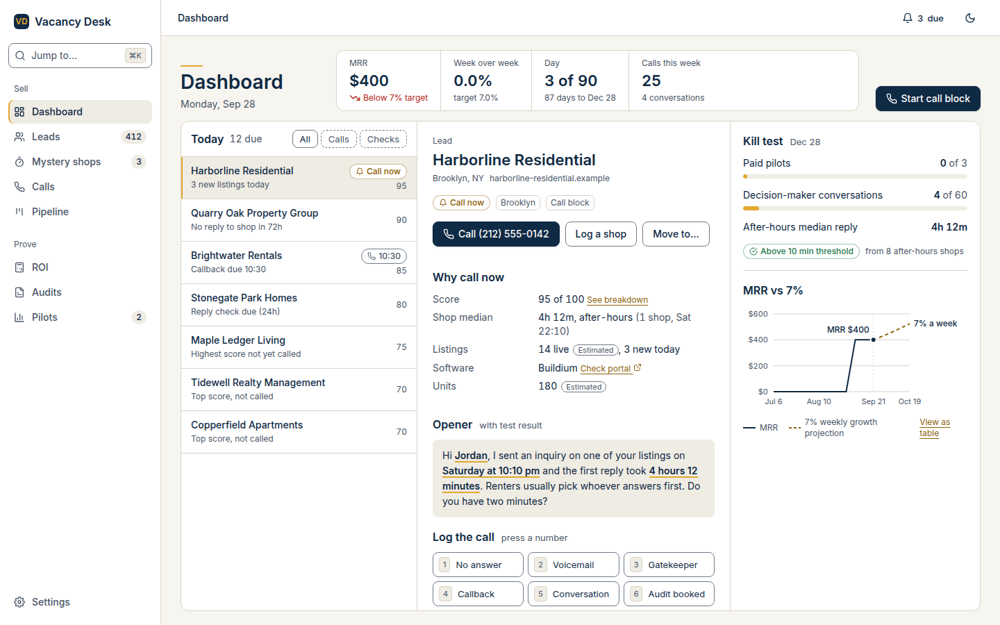
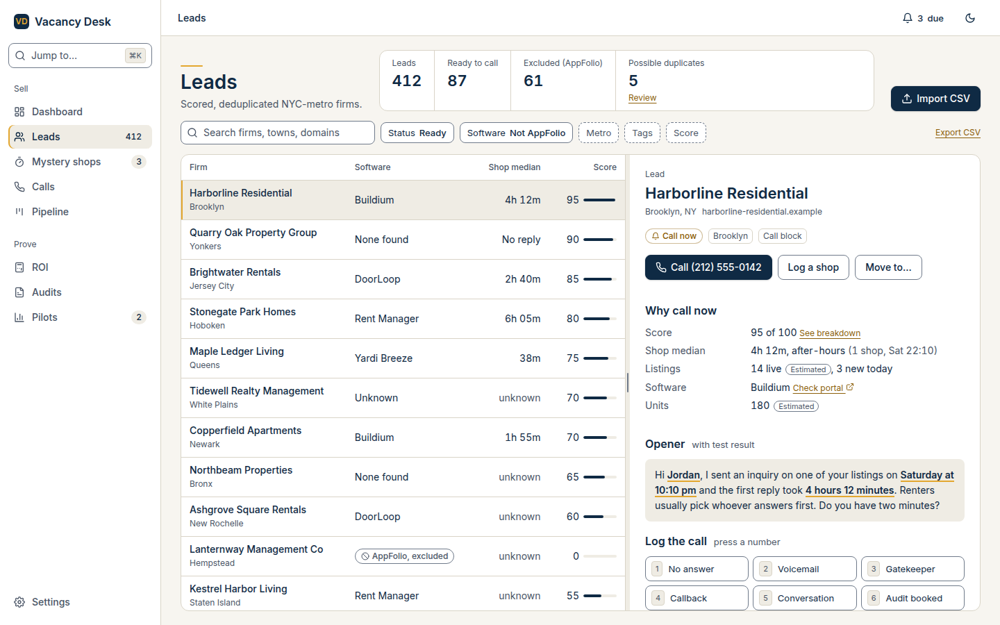

# UI directions: Dashboard and Leads

Three layout directions for the founder to choose from before Step 2. Each follows the flow rules:

- one primary action per page;
- sections with headings, not a grid of identical cards;
- lead detail in a side panel, not a new page;
- ⌘K everywhere;
- the same page header everywhere: title, key numbers, primary action.

The mocks are static HTML built from our exact tokens and fictional seed-style data (`build.mjs`), screenshotted at 1440×900 in light mode (`shoot.mjs`).

## Research summary

**shadcn blocks (Base UI, `ui.shadcn.com`, reachable)**

| Block or component                                      | Use                                    | Verdict                                                                                                                                                                                                                                                                                      |
| ------------------------------------------------------- | -------------------------------------- | -------------------------------------------------------------------------------------------------------------------------------------------------------------------------------------------------------------------------------------------------------------------------------------------- |
| `sidebar-16` (sidebar + sticky site header + search)    | Shell for A and C                      | Use: grouped nav, header with breadcrumb                                                                                                                                                                                                                                                     |
| `sidebar-07` (collapses to icons)                       | Shell for B                            | Use in B                                                                                                                                                                                                                                                                                     |
| `dashboard-01`                                          | Dashboard reference                    | **Partly.** Take its data-table pattern (TanStack Table), `chart-area-interactive` (Recharts) and site header. **Reject `section-cards`**: a grid of identical KPI cards with gradient washes, both on the brief's banned list. It's replaced by one "key numbers" strip in the page header. |
| `command` (`cmdk`, MIT)                                 | ⌘K menu: leads, pages, actions         | Use in all three                                                                                                                                                                                                                                                                             |
| `resizable` (`react-resizable-panels`, MIT)             | List + detail split                    | C only                                                                                                                                                                                                                                                                                       |
| `sheet`                                                 | Overlay side panel                     | A (C on narrow screens)                                                                                                                                                                                                                                                                      |
| `chart` (`recharts`, MIT)                               | MRR vs 7% projection                   | All three                                                                                                                                                                                                                                                                                    |
| `item`, `kbd`, `toggle-group`, `breadcrumb`, `progress` | Rows, hotkeys, filters, crumbs, meters | All three                                                                                                                                                                                                                                                                                    |

**reui.io (Data Grid, Filters, Kanban, stat cards): BLOCKED** by the environment's network policy. Until it's allowed, the fallback is shadcn's TanStack data-table pattern plus `@tanstack/react-virtual` for 5,000 rows, with filter chips built on `toggle-group` and `popover`. Kanban isn't needed until Step 5.

**Chart palette check (dataviz validator).** Navy #0F2A44 fails the categorical "lightness band" and "chroma floor" checks, meaning it reads as near-black rather than as a series color. So the MRR chart uses **one** solid series (navy) plus the 7% projection as a **dashed reference line** with direct labels and a legend. Identity never depends on color alone. The real chart will be re-validated in both themes when it's built.

---

## Direction A: Command center (dense overview, overlay panel)

 

```
┌ sidebar ┐┌──────────────────────────────────────────────────────────────────┐
│ ⌘K Jump ││ Dashboard    [MRR | WoW | Day 3/90 | Calls]      [Start call block]│
│ Sell    │├──────────────────────────────────┬───────────────────────────────┤
│  Dash   ││ Today (5 of 12 due)   Open list  │ Day-90 kill test              │
│  Leads  ││ firm / why / median / score rows │  meters: pilots, convos, AH   │
│  Shops  ││──────────────────────────────────│ MRR vs 7% a week (chart)      │
│  Calls  ││ This week (table vs last week)   │                               │
│ Prove   ││                                  │                               │
└─────────┘└──────────────────────────────────┴───────────────────────────────┘
Leads: header → filter chips → full-width table → row click → overlay Sheet (520px)
```

- **Blocks:** `sidebar-16`, `dashboard-01` table and chart pattern, `sheet`, `command`, `progress`.
- **Flow:** Dashboard → Today row (e.g. Harborline, "Call now") → **overlay panel** with why-now, opener and hotkeys → Call (`tel:`) → press 1–9 to log → Esc closes → back on the same row.
- **Good:** everything visible at once; closest to the brief's "answers am I on track without scrolling".
- **Trade-off:** the panel covers the list while it's open, so you can't see the next firm.

## Direction B: Focus mode (one task at a time)

 

```
┌icons┐┌───────────────────────────────────────────────────────────────────────┐
│ ▣   ││ Good morning   [MRR | Day | Convos | Pilots]         [Call Harborline]│
│ 👥  │├──────────────────────────────────────────┬────────────────────────────┤
│ ⏱   ││ NEXT UP 1 of 12        Call now          │ Then (queue of next 4)     │
│ ☎   ││ Harborline Residential (36px)            │                            │
│     ││ 4h 12m   3 new   95  (48px numbers)      │ Kill test meters           │
│     ││ opener script                            │                            │
│     ││ [Open lead] [Skip]  press 1–9 to log     │                            │
│     │├──────────────────────────────────────────┴────────────────────────────┤
│     ││ ▸ Growth and this week (collapsed)                                    │
└─────┘└───────────────────────────────────────────────────────────────────────┘
Leads: "Review new leads": queue rail + one firm at a time (software, status, tags)
       [Keep and next ↵] [Exclude E] [Skip S]; "See all as a table" link
```

- **Blocks:** `sidebar-07` (icons), `command`, `item`, `kbd`, `select`, `progress`.
- **Flow:** Dashboard → the "Next up" card → Call (header primary) → log 1–9 → the next firm loads automatically. Leads becomes an import triage queue.
- **Good:** the big navy numbers make the case for the call; lowest cognitive load during call blocks.
- **Trade-off:** weak for browsing and comparing 5,000 leads. Growth numbers are hidden in a collapsed section, which works against "am I on track at a glance".

## Direction C: Split view (list + persistent detail)

 

```
┌ sidebar ┐┌──────────────────────────────────────────────────────────────────┐
│ ⌘K Jump ││ Dashboard    [MRR | WoW | Day 3/90 | Calls]      [Start call block]│
│ Sell    │├──────────────┬────────────────────────────────┬──────────────────┤
│  Dash   ││ Today 12 due │ Harborline Residential         │ Kill test meters │
│  Leads  ││ [All|Calls|  │ [Call] [Log a shop] [Move to…] │                  │
│  Shops  ││  Checks]     │ Why call now (score, median…)  │ MRR vs 7% chart  │
│  Calls  ││ ▸ Harborline │ Opener (variables filled)      │                  │
│ Prove   ││   Quarry Oak │ Log the call 1–6 hotkeys       │                  │
└─────────┘└──────────────┴────────────────────────────────┴──────────────────┘
Leads: header → filter chips → [table 640px ‖ resizable ‖ lead detail]
```

- **Blocks:** `sidebar-16`, `resizable`, TanStack data table, `command`, `chart`, `progress`, `kbd`. Below 1280px the detail pane becomes a `sheet` (Direction A's behavior); on phones the list becomes cards and the detail a full-height sheet.
- **Flow:** Dashboard → click or ↓ to a Today item → the detail updates **in place** → Call → 1–9 logs and moves to the next item. The list never disappears, so you never lose your place. The Leads page uses the same pattern.
- **Good:** fastest for call blocks and lead review, with the same muscle memory on every page.
- **Trade-off:** the densest option. At 1440px it's tight but fits; below that it drops to the overlay pattern.

## Recommendation

**C (split view)**, because it best meets the "never lose my place" and "same pattern on every page" rules, and it serves both the call block and the 5,000-lead list. B's "Next up" card could later become an optional _call-block mode_ inside C (logged in `docs/ideas.md` if wanted; not built now).
